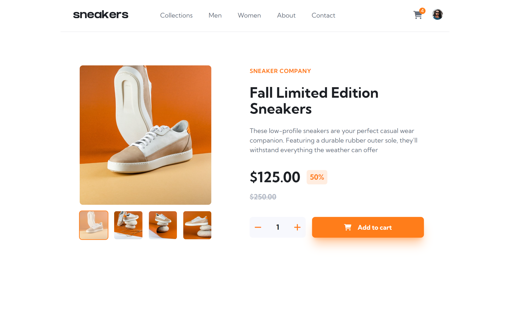
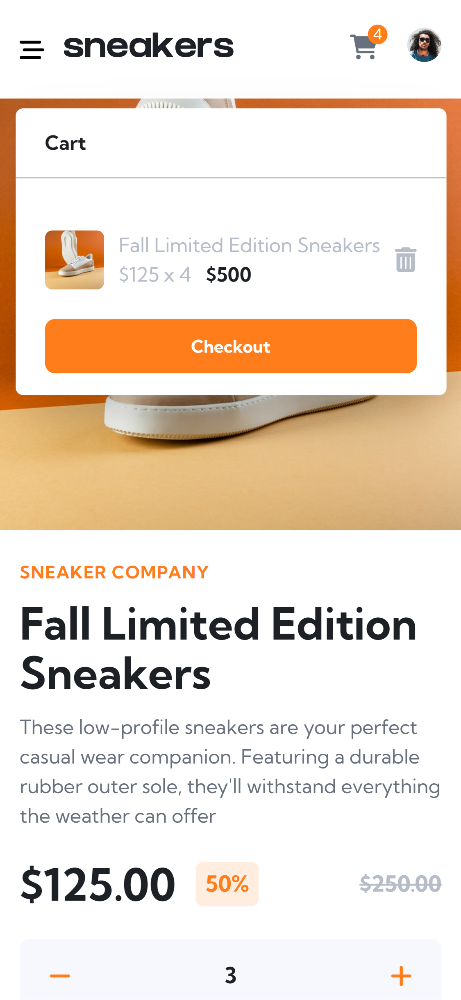

# Frontend Mentor - E-commerce product page solution

This is a solution to the [E-commerce product page challenge on Frontend Mentor](https://www.frontendmentor.io/challenges/ecommerce-product-page-UPsZ9MJp6). Frontend Mentor challenges help you improve your coding skills by building realistic projects.

## Table of contents

- [The challenge](#the-challenge)
- [Screenshot](#screenshot)
- [Links](#links)
- [Built with](#built-with)
- [What I learned](#what-i-learned)
- [Continued development](#continued-development)

### The challenge

Users should be able to:

- View the optimal layout for the site depending on their device's screen size
- See hover states for all interactive elements on the page
- Open a lightbox gallery by clicking on the large product image
- Switch the large product image by clicking on the small thumbnail images
- Add items to the cart
- View the cart and remove items from it

### Screenshot

### Links

### Built with

- Semantic HTML5 markup
- Tailwind Css
- Flexbox
- CSS Grid
- Mobile-first workflow
- Vanilla JS
- Async-Await

### What I learned

One of the most important lesson I learned during the project was perseverance. I had a lot of bugs during the project but I was able to find and fix them by being calm and focused.

### Continued development

I plan on doing one more project from the FrontendMentor challenges involving ajax/json to get myself acquainted with api integrations before starting on React.
